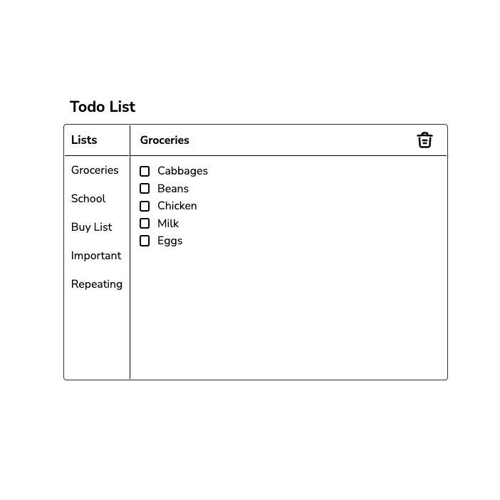

# Todo Application

> ### About
This is a simple web based to-do list application, that supports multiple lists, and can work offline. I built this as a simple side project and out of frustration of not being able to find a simple todo application online, despite the trillions of demos. 

> ### How to use
It should be pretty self-explanatory

> ### Screenshot

